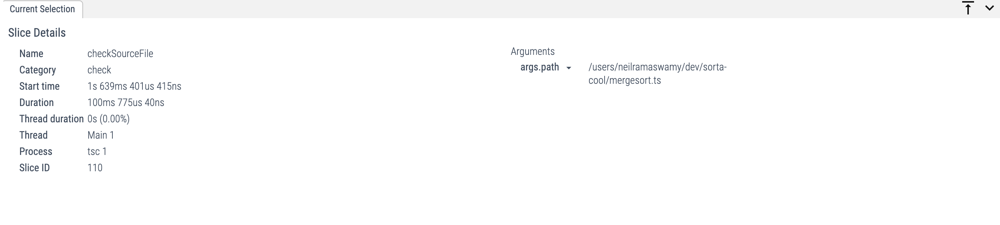
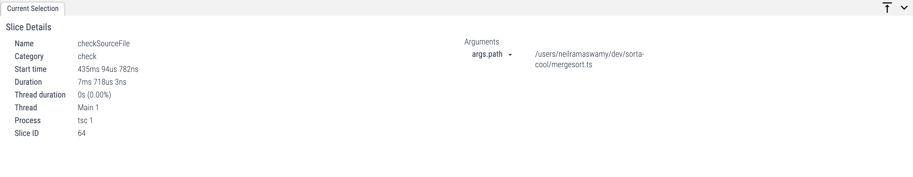

# Sorta Cool

I was on a 10 hour flight with no WiFi, and, bored out of my mind, I thought it would be fun to implement some sorting algorithms in the Typescript type system. When I landed, I had the idea to do some performance analysis to make my implementation faster. I implemented Insertion Sort and Merge Sort, and I profiled (and optimized) my code using the `--generateTrace` flag in `tsc`.

This is what it looks like when you sort in the type system:


Useless, right?

### On the Name of this Project

I named this "Sorta Cool" for a few reasons:

1. The obvious pun.
2. It's the type of project which is sort of useless, but also sort of fun. So it's sort of cool (not very cool).
3. As I wrote this, I constantly thought to myself, "I wonder what Shriram would think of this," which reminded me of [Sortacle](https://cs.brown.edu/courses/cs019/2019/sortaclesortacle.html) from Brown's CS 0190 course.

### How Does it Work?

I'm going to assume strong ability with the following Typescript concepts (soon, I'll update this section to be more accessible to readers who aren't as familiar with these Typescript concepts):

-   [Conditional types](https://www.typescriptlang.org/docs/handbook/2/conditional-types.html) (using `extends` and `infer`)
-   Recursive conditional types

#### Numeric Comparison

I implemented a numeric comparison type, `Cmp<A, B>` between any two integers. It uses the following logic:

-   WLOG, If A is negative but B is non-negative, B is bigger.
-   If A and B are both negative, return `Cmp<Abs<B>, Abs<A>>`, where `Abs<T>` computes the absolute value of some integer. The implementation of `Abs` can be found in `math.ts` which is fairly simple to read.
-   If A and B are both positive, you'll need to read on...

When A and B are both positive, we can determine which one is larger by keeping two counters, which are actually just arrays of numbers:

`type PositiveIntegerCmp<A, B, ACounter = [], BCounter = []> = ...`

Let the boolean `a` correspond to `A` being equal to the length of `ACounter`. Let the boolean `b` be analogous for `B`. Then, we can use the following algorithm:

-   `!a && !b` means that neither list is long enough. Add one element to each and recurse: `PositiveIntegerCmp<A, B, [0, ...ACounter], [0, ...BCounter]>`.
-   `a && !b` means that `A` must be smaller than `B`, since it's length was reached first. Return `B`.
-   `b && !a` means that `A` is larger by the same logic.
-   `a && b` means that they are the same length.

#### Array Merging

Now that we can compare two integers, we are now ready to merge two arrays together. I wrote a `Merge<A extends number[], B extends number[]>` type that "returns" one `number[]`, which merges two already sorted (in ascending order) arrays `A` and `B`. This type works in the following way:

-   `infer` the first element from each list. Compare them, and add the smaller one to an accumulator list.
-   If there are no elements in either list, return the accumulator.

The accumulator is stored within the `Merge` type itself, which is made to work with a default argument of `Acc extends number[] = []`.

#### Array Splitting

To implement Merge Sort correctly, we have to split an array type into two parts, i.e. implement `type Split<T extends number[]>`, which gives back `[number[], number[]]`. At first, I thought I could split the given array down the middle, but it's hard to know where the middle is in an array type. I thought I could do something like `T extends [infer First, ...infer Middle, infer Rest]`, but `infer`ence [is greedy](https://github.com/microsoft/TypeScript/issues/46124#issuecomment-930388594), which means that `Middle` would have all but the first element, and `Rest` would not be matched.

Instead, I opted to split the array by index parity, which is just a pretentious way of saying the even indexed elements go in the first basket and the odd indexed elements go in the second basket. Again, I keep two accumulators in the `Split` type declaration, and constrain `T` to `[infer First, infer Second, ...infer Rest]`. I add `First` into the First accumulator, add `Second` into the second accumulator, and I pass the result of both of those into a recursive split call of `Split<Rest, NewAcc1, NewAcc2>`.

#### Merge Sorting

Putting it all together is fairly simple in comparison to the other types. If we have `MergeSort<T extends number[]>`, we have two cases:

-   If `T['length']` is less than 2, return `T`.
-   Otherwise, compute return `Merge<MergeSort<Split<T>[0]>, MergeSort<Split<T>[1]>>`. You might notice that we're recomputing `Split` on both branches; you can check the source code to see how this is optimized.

### Optimizing Type Evaluation

I figured I could optimize my types by generating traces while running `tsc`. I made the assumption that optimizing `tsc` would make my IntelliSense run faster in VSCode, since anyway IntelliSense speaks to `tsserver`, which just uses `tsc`. I ran the following command to generate traces:

```
./node_modules/typescript/bin/tsc -p . --generateTrace traces/
```

I loaded `traces/trace.json` into [Perfetto](https://ui.perfetto.dev/), and saw that my original `MergeSort` type took ~100ms to compile. And there was a lot of recursion:



After making a few tweaks, I got `MergeSort`'s `checkSourceFile` call down to less than 10ms:



Finally, I noticed that about ~800ms were spent compiling `dom.d.ts`, so I avoided doing that extra work by setting the environment to `ES5`. I also set `noEmit` to true, which saved ~15 milliseconds (the JS files were anyway empty). In total, I was able to bring "compilation" (the PL people will hurt me for using that word, since nothing is being compiled... I think) down by ~105ms, which is a 20% decrease!

### Playing with This

If you're using VSCode, you'll need to use the Typescript version from this project, since this project relies on a bit of functionality from Typescript 4.8 (which is in beta at the time of this writing). This should be done automatically once you `npm install`, since I included the `.vscode` directory.

I'll buy you a coffee/beer if you implement Quicksort (and submit it as a PR) with a non-trivial pivot scheme. Good luck. My wallet is ready.
