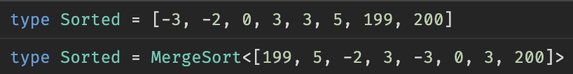

# Sorta Cool

I was on a 10 hour flight with no WiFi, and, bored out of my mind, I thought it would be fun to implement some sorting algorithms in the Typescript type system. When I landed, I had the idea to do some performance analysis to make my implementation faster. I implemented Insertion Sort and Merge Sort, and I brought the compile time down ~4.5x, from ~2300ms to ~490ms.

This is what it looks like when you sort in the type system:



Useless, right?

#### On the Name of this Project

I named this "Sorta Cool" for a few reasons:

1. The obvious pun.
2. It's the type of project which is sort of useless, but also sort of fun. So it's sort of cool (not very cool).
3. As I wrote this, I constantly thought to myself, "I wonder what Shriram would think of this," which reminded me of [Sortacle](https://cs.brown.edu/courses/cs019/2019/sortaclesortacle.html) from Brown's CS 0190 course.

#### Background Knowledge

If you want to understand how this works, you'll need to be familiar with Typescript's recursive conditional types. If you're already familiar, skip to the [next section](#how-does-it-work). I'll try to explain them briefly here.

A type just provides a nice way to talk about a set of values. The `string` type in Typescript refers to the set of all possible strings. The union type `"alice" | "bob"` refers to the set containing two strings "alice" and "bob".

You can write types that take in other types as input. I can write a type that takes in a generic string type parameter, and unions another string into the set (the union operator is `|`). This would look like `type AddBob<T> = T | "bob"`. To _constrain_ the generic `T` to be a string, we can say `type AddBob<T extends string>`, and the compiler will yell at us if we pass `AddBob` a non-string type "argument".

```ts
// "alice" | "bob"
type AliceAndBob = AddBob<'alice'>

// "charlie" | "bob"
type CharlieAndBob = AddBob<'charlie'>

// Can't pass in a number, since AddBob wants a string
type ThisIsATypeError = AddBob<10>
```

The `extends` keyword also has another use in addition to constraining what a generic type can be. It allows us to implement a _conditional_ type. Let's say Bob has a crush on Alice and wants to spend time with only her. Our `AddBob<T>` type should only union in Bob if `<T>` is "Alice". We can write that as follows:

```ts
// "If T is 'alice', return T and bob. Otherwise, return T.
type AddBob<T extends string> = T extends 'alice' ? T | 'bob' : T

// "alice" | "bob"
type AliceAndBob = AddBob<'alice'>

// Just "charlie", since Bob only wants to hang out with alice
type LonelyCharlie = AddBob<'charlie'>
```

You can get fancier with this by adding in pattern matching. You can say, if some type `T` extends some pattern that I have, then do something; otherwise, do something else. Let's say we have a type that takes in a string and removes the leading spaces if applicable. We want the following:

```ts
// We''ll fill this out soon
type Strip<T extends string> = ...

// Should be "abc"
RemoveA<" abc">

// Should be "abc"
RemoveA<"abc">

// Two leading spaces; removing one yields " cba"
RemoveA<"  cba">
```

For `Strip`, we want to say: if `T` starts with space, return the remaining part of the string. If it doesn't start with a space, just return the string. That looks like the following:

```ts
type Strip<T extends string> = T extends ` ${infer Rest}` ? Rest : T
```

Nifty, right? Finally, let's try to figure out how we can strip _all_ leading A's. To do this, we can make a recursive call to `Strip`: when we remove a space by inferring `Rest`, we "return" `Strip<Rest>`.

```ts
type Strip<T extends string> = T extends ` ${infer Rest}` ? Strip<Rest> : T

// "cba", yay!
Strip<'  cba'>
```

In sum, we have the following building blocks:

-   "if/else" statements using `extends`
-   Pattern matching using `extends` and `infer`
-   Recursion

Note that pattern matching applies not just to strings (i.e. ` ${infer Rest}`) but also to arrays. If you have an array type `A`, you can do stuff like `A extends [infer First extends number, ...infer Rest[]]`, which will pattern match to all arrays whose first element is a number. These fundamental concepts will allow us to implement Merge Sort in the type system!

#### How Does it Work?

I'll explain how I implemented Merge Sort, since that's more tricky than Insertion Sort. You'll probably want to have read the previous section, or already know how type scripting works in Typescript.

#### Numeric Comparison

I implemented a numeric comparison type, `Cmp<A, B>` between any two integers. If `A < B`, it evaluates to -1. If they are equal, it evaluates to 0. If `A > B`, it evaluates to 1. It uses the following logic:

-   WLOG, If A is negative but B is non-negative, B is bigger. I determine whether a number is negative by casting it a string and pattern matching to `-${infer A}`. If it matches, it's negative.
-   If A and B are both negative, return `Cmp<Abs<B>, Abs<A>>`, where `Abs<T>` computes the absolute value of some integer. The implementation of `Abs` can be found in `math.ts` which is fairly simple to read.
-   If A and B are both positive, you'll need to read on...

When A and B are both positive, we can determine which one is larger by keeping two counters, which are actually just arrays of numbers:

`type PositiveIntegerCmp<A, B, ACounter = [], BCounter = []> = ...`

Let the boolean `a` correspond to `A` being equal to the length of `ACounter`, which we can find with `ACounter['length']`. Let the boolean `b` be analogous for `B`. Then, we can use the following algorithm:

-   `!a && !b` means that neither list is long enough. Add one element to each and recurse: `PositiveIntegerCmp<A, B, [0, ...ACounter], [0, ...BCounter]>`.
-   `a && !b` means that `A` must be smaller than `B`, since it's length was reached first. Return -1.
-   `b && !a` means that `A` is larger by the same logic. Return 1.
-   `a && b` means that they are the same length. Return 0.

#### Array Merging

Now that we can compare two integers, we are now ready to merge two arrays together. I wrote a `Merge<A extends number[], B extends number[]>` type that "returns" one `number[]`, which merges two already sorted (in ascending order) arrays `A` and `B`. This type works in the following way:

-   `infer` the first element from each list. Compare them, and add the smaller one to an accumulator list.
-   If there are no elements in either list, return the accumulator.

The accumulator is stored within the `Merge` type itself, which is made to work with a default argument of `Acc extends number[] = []`. Thus, `Merge` actually looks like:

```ts
Merge<A extends number[], B extends number, Acc extends number[] = []>
```

#### Array Splitting

To implement Merge Sort correctly, we have to split an array type into two parts, i.e. implement `type Split<T extends number[]>`, which gives back `[number[], number[]]`. At first, I thought I could split the given array down the middle, but it's hard to know where the middle is in an array type. I thought I could do something like `T extends [infer First, ...infer Middle, infer Rest]`, but `infer`ence [is greedy](https://github.com/microsoft/TypeScript/issues/46124#issuecomment-930388594), which means that `Middle` would have all but the first element, and `Rest` would not be matched.

Instead, I opted to split the array by index parity, which is just a pretentious way of saying the even indexed elements go in one bucket and the odd indexed elements go in to different bucket. I keep two accumulators in the `Split` type declaration, and pattern match `T` to `[infer First, infer Second, ...infer Rest]`. I add `First` into the first accumulator, add `Second` into the second accumulator, and I pass the result of both of those into a recursive `Split` call: `Split<Rest, [...Acc1, First], [...Acc2, Second]>`.

#### Merge Sorting

Putting it all together is fairly simple in comparison to the other types. If we have `MergeSort<T extends number[]>`, we have two cases:

-   If `T['length']` is `0` or `1`, return `T`.
-   Otherwise, compute return `Merge<MergeSort<Split<T>[0]>, MergeSort<Split<T>[1]>>`. You might notice that we're recomputing `Split` on both branches; my optimization of this is discussed in the next section.

### Optimizing Type Evaluation

I figured I could optimize my types by generating traces while running `tsc`. I figured that optimizing `tsc` would make my IntelliSense run faster in VSCode, since anyway IntelliSense speaks to `tsserver`, which just uses `tsc`. My methodology was from [here](https://github.com/microsoft/TypeScript/wiki/Performance-Tracing); I ran the following command to generate traces:

```
./node_modules/typescript/bin/tsc -p . --generateTrace traces/
```

I loaded `traces/trace.json` into [Perfetto](https://ui.perfetto.dev/), looked for calls that seemed like they took relatively long, and made the following improvements.

##### Computing Absolute Values Faster

Because this sorting implementation takes the absolute value of negative numbers to compare them (see `Cmp` in the [Numeric Comparison](#numeric-comparison) section), we need an `Abs` type. Here was my first implementation of it:

```ts
type Abs<T extends number> = `${T}` extends `-${infer Rest extends number}`
    ? Rest // Crap, this is a string
    : T // Yay, a number
```

This situation isn't great: `Abs` either returns a string ("Crap") or a number ("Yay"). I then wrote an `AtoI` function that would take in a string and evaluate to a number; it did so using recursion in such a way that casting a string `N` to a number would make `N` recursive calls. This was pretty slow:

(TODO: Image of this being slow.)

Then, I realized that in TypeScript 4.8, [better inference was introduced](https://devblogs.microsoft.com/typescript/announcing-typescript-4-8/#improved-inference-for-infer-types-in-template-string-types) for `infer` types. So, I upgraded to the version 4.8 beta, reverted to my original code without `AtoI`, and saw a MASSIVE (TODO, quantity) performance boost!

##### Avoiding Repeated Work with "Intermediate" Variables

At first, my `MergeSort` type was approximately the following (where `Split` was described [earlier](#array-splitting)):

```ts
// Omitting the base case of T.length < 2 for simplicity here
// The actual code does have it
type MergeSort<T> = MergeSort<Split<T>[0], Split<T>[1]>
```

See what's wrong here? We're calling `Split` twice. I had the idea to "refactor" this into a temporary variable introduced in the type signature (PL folks, I'm sure my terminology is wrong here; please do not hurt/make fun of/call me out/etc. on PL Twitter):

```ts
type MergeSort<T, S = Split<T>> = Merge<MergeSort<S[0]>, MergeSort<S[1]>>
```

Turns out this doesn't work! I wasn't able to determine why, but TypeScript seems to think that this is infinitely recursive. My second attempt at doing this worked:

```ts
// Again, this code is an approximation.
// Check the source if you want the real deal.
type MergeSort<T> = Split<T> extends infer S
    ? Merge<MergeSort<S[0]>, MergeSort<S[1]>>
    : T // Will never happen
```

The main takeaway is that you can introduce "variables" by doing an operation, saying that it should `extend infer SomeVariable`, and then using `SomeVariable` in multiple places.

##### Skipping Compilation of Irrelevant Files

And for some low hanging fruit, I noticed that about ~800ms were spent compiling `dom.d.ts`, so I avoided doing that extra work by setting the environment to `ES5`. I also set `noEmit` to true, which saved ~15 milliseconds (the JS files were anyway empty). In total, I was able to bring "compilation" (the PL people will hurt me for using that word, since nothing is being compiled... I think) down by ~105ms, which is a 20% decrease!

### Playing with This

If you're using VSCode, you'll need to use the Typescript version from this project, since this project relies on a bit of functionality from Typescript 4.8 (which is in beta at the time of this writing). This should be done automatically once you `npm install`, since I included the `.vscode` directory.

I'll buy you a coffee/beer if you implement Quicksort (and submit it as a PR) with a non-trivial pivot scheme. Good luck. My wallet is ready.
